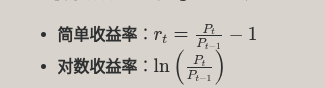

## Developing Algorithmic Trading Models

Building algorithmic trading models starts with acquiring historical price data. The goal is to train models to recognize patterns and price movements reliably. However, the quality and relevance of data are more important than quantity due to:

* **Changing Conditions** : Financial markets are influenced by evolving regulations, conventions, and economic environments.
  * Older financial data might not be comparable to current data due to changes like differing accounting standards.
* **Regulatory Changes** : Events such as the Sarbanes Oxley Act in 2002 affect financial reporting, impacting data reliability.
* **Market Dynamics** : Interest rates, technology, and economic cycles affect market behavior and the relevance of historical data.

Changes in financial reporting and the relationship between cash flows and earnings show how financial trends can shift over time. Recognizing these variations is vital when selecting datasets.

### Data Selection Strategy

* **Relevance Over Volume** :
  * Use recent data that reflects current market conditions for accurate model training.
* **Balance Data Quality and Quantity** :
  * Avoid overfitting by using enough relevant data without introducing outdated patterns.

By carefully selecting historical datasets, it's possible to craft robust models, reflect current market realities, and provide reliable AI-driven insights for trading strategies.

#### 简单**与对数收益率** **（Log Return）**

* 
* 量化中**简单收益率更常用**于组合计算， **对数收益率更适用于建模** **（可加性）**

### 在策略中的用途

* **因子计算** ：动量因子 = 过去 N 日 `pct_change` 之和
* **标签生成** **：**`forward_returns = close.pct_change().shift(-1)`
* **风险指标** **：波动率 = 收益率的标准差**
