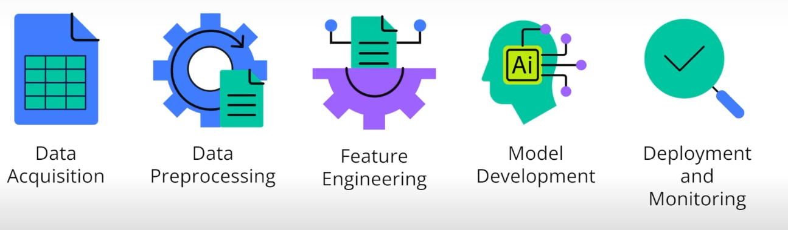
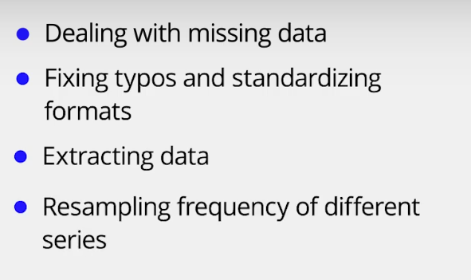

Preprocessing is a critical concept in any successful ML model. In this course, you will learn the basics of data engineering, data selection, and exploratory data analysis.

## Preparing for Data Analysis

### 1. An Overview of Machine Learning Pipelines

Developing a question to answer is the first step in the machine learning pipeline.

#### Data Acquisition

api

#### Data preprocessing

same date format

* same col name
* 

#### Feature Engineering

What?

* create **new attributes** columns using exsiting columns

Model Development

* supervised leanring
* unsupervised learning
* RL

很多模型的使用都有一些假设前提，Assumptions outline the expected relationships within the data and the underlying model(假设勾勒数据和模型的预期关系))

difference between predictive and explanatory machine learning model?

* A predictive model focuses on accurately predicting future outcomes, while an explanatory model focuses on understanding the relationships between variables.

Baseline Model

* **Initial Step** : Assess algorithm potential prior to detailed optimization.
* **Utility** : Helps determine whether to refine the current model or consider alternatives.

#### Model Deployment and Monitoring

* **Benefits of API:** By wrapping the model's prediction code into a Python script and function, the deployment becomes clean and straightforward, enriching usability and monitoring.

## Addressing Common Pandas Data Issues

### Key Concepts:

* **Data Importation Challenges** : Sometimes when importing datasets into Pandas, numeric data might be read as strings because of characters like dollar signs or commas.

### Problem Areas:

* **Non-Numeric Characters** :
* **Price Column** : Contains unwanted dollar signs.
* **Revenue Column** : Uses commas for the thousand separators.
* **Quantity Column** : May have strings where numbers are expected.

### Solutions:

1. **Recognizing Data Types** :

* Use `.info()` to identify data types and check if columns are mistakenly read as objects (strings).

1. **Cleaning Up Data** :

* **Replacing Characters** :
  * Remove dollar signs using the `.replace()` method with regex enabled.
  * Remove commas similarly.
* **Converting to Numeric** :
  * Use `.astype(float)` to convert cleaned data to numeric values.

1. **Dealing with Errors** :

* Use `pd.to_numeric()` with `errors='coerce'` for converting strings to NaN where they can't be made numeric initially.
