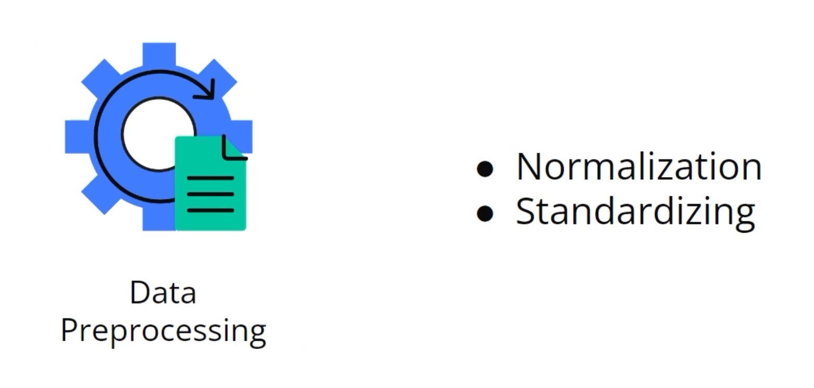

### Intro To Data Ingestion

**Data Ingestion（数据摄取）**  是指从各种不同的来源（Source）采集或接收原始数据，并将其传输到某个存储或处理系统（Target）中的过程。

* **Data Ingestion**

  * Determine the current data format and its destination.
  * Best practice is to use Pandas for data import unless handling exceptionally large datasets (>100GB).
* **Organizing Data**

  * Store data files in a project subfolder titled 'Data' for easy access.
  * Prefer CSV format for downloading and organizing data files.
* **Using Pandas for Data Handling**

  * Pandas is recommended for importing, manipulating, and exporting relational data.
  * Supports various file types like CSV and Excel.
  * Offers robust features and quick resolutions for bugs due to a large user base.
* **Alternatives to Pandas**

  * Consider libraries like Dask, PySpark, or Polars when dealing with very large data or requiring faster computations.

## Introduction to Data Preprocessing in Machine Learning

Data preprocessing is a crucial step in the machine learning pipeline, critical for refining data before model training. Here are the main concepts and actions involved:

* **Data Cleaning** : Ensure data consistency by removing or addressing corrupt or missing points; sometimes dropping insignificant data points is more efficient than trying to fix them.
* **Essential Preprocessing** : Always assess the necessity of preprocessing against the computational cost and potential performance gains.
* **Normalization** :
  * Adjusts data scale to fit between 0 and 1.
  * Useful for algorithms sensitive to data magnitude.
  * Implemented using the formula with data's max and min values.
* **Standardization** :
  * Converts data to a normal curve with mean 0 and standard deviation 1.
  * Helps understand data spread and is vital in features with varying scales.
* **Practical Application** : Preprocessing like standardization is especially important when handling financial data, ensuring consistency across variable scales (e.g., dollars vs. pennies).
* **Critical Assessment** : Continuously evaluate preprocessing methods regarding model performance readiness and adjust as necessary. Potential misuse could lead to inaccurate predictions despite properly running scripts.

两个最常用预处理技术：

