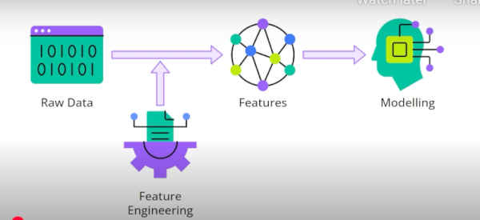
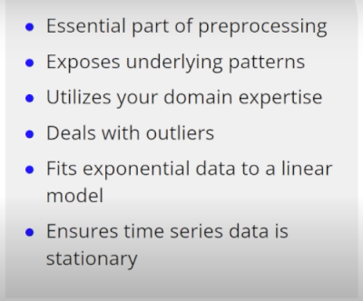
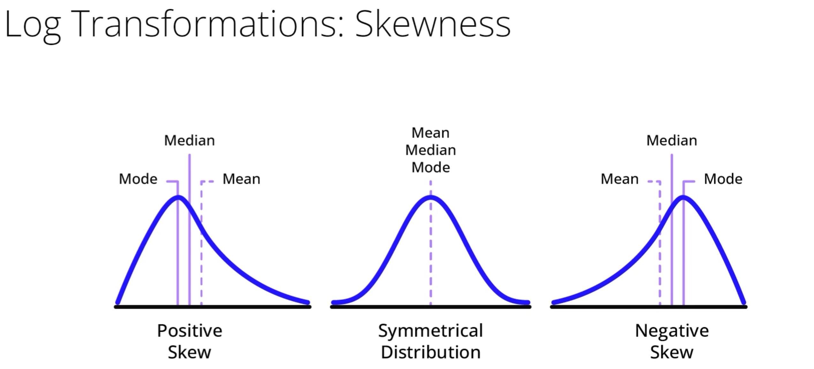
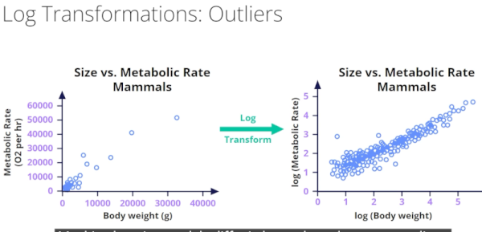
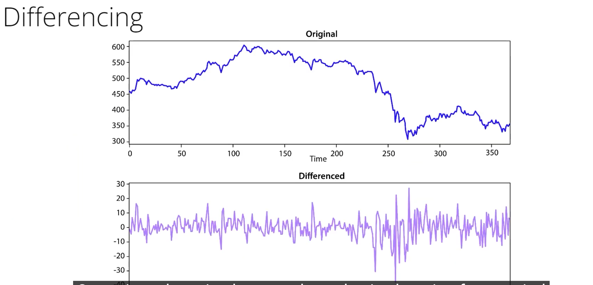
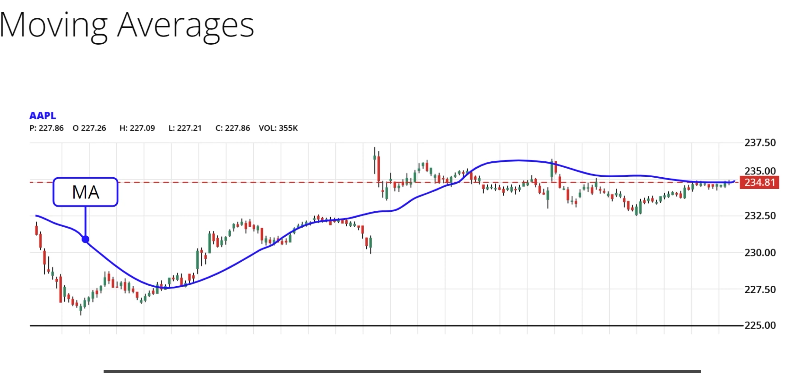
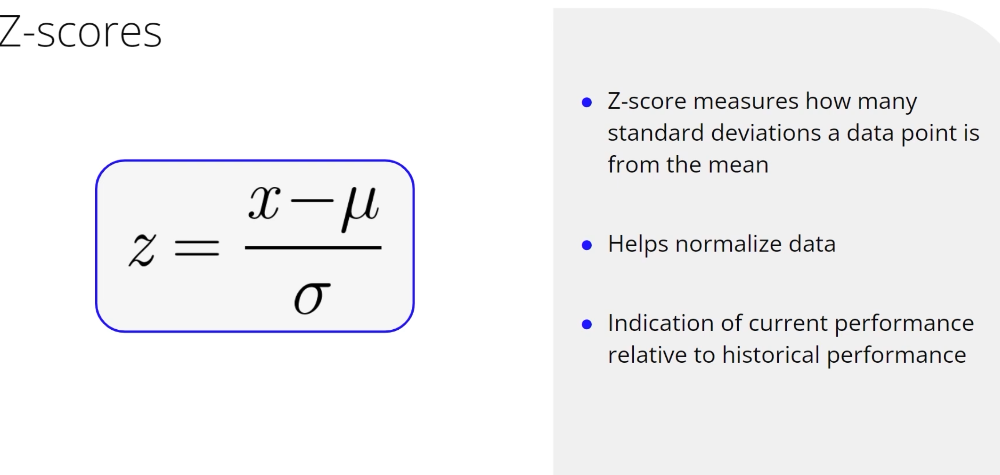
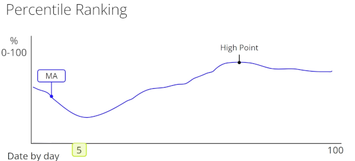
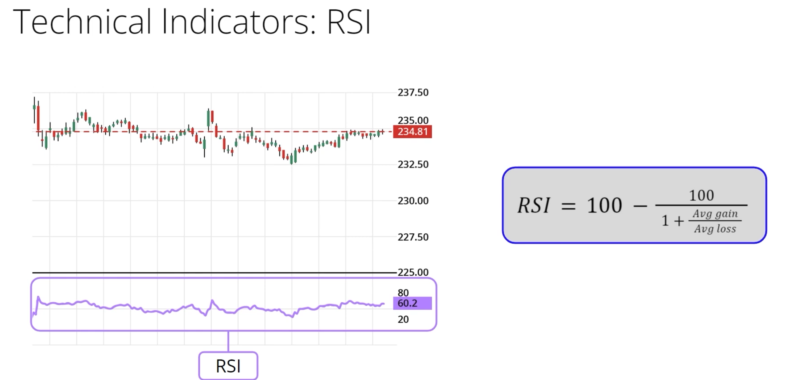
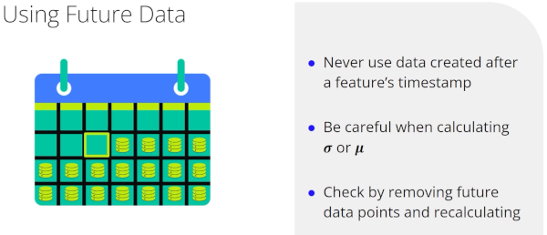

## Feature Engineering Essentials for Finance and Trading Models

Feature engineering transforms existing data to uncover underlying patterns and improve model performance.

### Guide to Feature Engineering in Financial Data

Explore essential techniques used in feature engineering for financial data, crucial for improving machine learning model performance. Here's a simplified walkthrough:

* **Regularly Update Knowledge** : Techniques evolve; stay updated with the latest literature in your domain.
* **Data Pre-processing** : Fundamental step involving cleaning and transforming data. Common methods include:
* **Normalization and Standardization** : Adjust the data to fit a consistent scale.
* **Log Transformation** : Mitigates skewness, critical for normal data input assumptions.
* **Differencing and Stationarity** :
* **Differencing** : Converts non-stationary data to stationary; removes seasonality by calculating period-to-period change.
* **Rate of Change (ROC)** :
* Measures trends and signals trade actions, calculated using percent change.
* **Moving Average** : Smooths out noise, helping identify trends over varying frequencies.
* **Z Scores and Percentiles** :
* Facilitate cross-comparison of stock performance and volatility.
* **Relative Strength Indicator (RSI)** :
* Provides insights into momentum, indicating overbought

### Feature Engineering Techniques

Log transformations

* skewness-改变偏斜
* 对异常数据鲁棒

移动平均，动量指标之一

RSI可以获取动量和趋势强弱

### 数据简化中两个核心的技术

： **分组（Binning）**  和  **特征工程（Feature Engineering）** ，特别是在金融交易信号场景下的应用。

以下是对其核心内容的提炼与解读：

#### 1. 分组（Binning）

 **定义** ：将连续数据划分为若干个离散区间（或“桶”）的过程。

 **核心目的** ： **简化数据，突出重要模式** 。

#### 2. 信号特征工程（Signal Feature Engineering）

 **定义** ：基于特定标准生成数据信号，以增强交易模型的预测能力。

 **核心应用** ：通常生成 **二元/分类信号** （如上涨/下跌、正面/负面）。

 **典型方法** ：利用技术指标（如移动平均线、趋势线）的交叉或阈值来定义信号。

### Essential Tips for Feature Engineering in Time Series

Feature engineering in time series involves creativity but requires caution to avoid common mistakes. Here are some critical considerations to keep in mind:

* **Avoid Future Data** :
  * Never use data from the future when engineering features.
  * Ensure calculations with present data, maintaining integrity and avoiding temporal leakage.
  * 
* **Timing and Data Availability** :
  * Utilize data available during the stated timeframe, respecting its release schedule.
  * Assign data to dates when it's released, not the period it represents.
* **Handle Missing Data Carefully** :
  * Drop observations that produce nulls, especially when using rolling averages.
  * Be cautious with initial data periods; they may lack sufficient data for calculations.
* **Ordinality in Categorical Data** :
  * Understand if categories impose order; apply numerical values properly.
  * Avoid assuming order in inherently unordered categories, like months.
  * 避免假设序数性，比如6月不是1月的6倍
* **如何验证Validation Technique** :
  * Double-check engineered features by removing recent data and attempting feature recreation.
  * Ensure feature creation is independent of future data.
